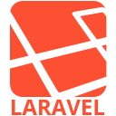

<!-- markdownlint-disable MD033 -->

[](https://git.io/typing-svg)
[](https://git.io/typing-svg)

## Some technologies I’ve built, broken, and fixed things with.

<br />
<p align="left">
  <a href="https://aws.amazon.com/amplify/" target="_blank" rel="noreferrer">
    
  </a>
  <a href="https://aws.amazon.com" target="_blank" rel="noreferrer">
    
  </a>
  <a href="https://azure.microsoft.com/en-in/" target="_blank" rel="noreferrer">
    
  </a>
  <a href="https://babeljs.io/" target="_blank" rel="noreferrer">
    
  </a>
  <a href="https://www.gnu.org/software/bash/" target="_blank" rel="noreferrer">
    
  </a>
  <a href="https://www.blender.org/" target="_blank" rel="noreferrer">
    
  </a>
  <a href="https://getbootstrap.com" target="_blank" rel="noreferrer">
    
  </a>
  <a href="https://bulma.io/" target="_blank" rel="noreferrer">
    
  </a>
  <a href="https://canvasjs.com" target="_blank" rel="noreferrer">
    
  </a>
  <a href="https://cassandra.apache.org/" target="_blank" rel="noreferrer">
    
  </a>
  <a href="https://www.chartjs.org" target="_blank" rel="noreferrer">
    
  </a>
  <a
    href="https://www.cockroachlabs.com/product/cockroachdb/"
    target="_blank"
    rel="noreferrer"
  >
    
  </a>
  <a href="https://codeigniter.com" target="_blank" rel="noreferrer">
    
  </a>
  <a href="https://www.w3schools.com/css/" target="_blank" rel="noreferrer">
    
  </a>
  <a href="https://www.cypress.io" target="_blank" rel="noreferrer">
    
  </a>
  <a href="https://d3js.org/" target="_blank" rel="noreferrer">
    
  </a>
  <a href="https://www.docker.com/" target="_blank" rel="noreferrer">
    
  </a>
  <a href="https://www.elastic.co" target="_blank" rel="noreferrer">
    
  </a>
  <a href="https://www.electronjs.org" target="_blank" rel="noreferrer">
    
  </a>
  <a href="https://expressjs.com" target="_blank" rel="noreferrer">
    
  </a>
  <a href="https://www.figma.com/" target="_blank" rel="noreferrer">
    
  </a>
  <a href="https://firebase.google.com/" target="_blank" rel="noreferrer">
    
  </a>
  <a href="https://flask.palletsprojects.com/" target="_blank" rel="noreferrer">
    
  </a>
  <a href="https://www.framer.com/" target="_blank" rel="noreferrer">
    
  </a>
  <a href="https://www.gatsbyjs.com/" target="_blank" rel="noreferrer">
    
  </a>
  <a href="https://cloud.google.com" target="_blank" rel="noreferrer">
    
  </a>
  <a href="https://git-scm.com/" target="_blank" rel="noreferrer">
    
  </a>
  <a href="https://graphql.org" target="_blank" rel="noreferrer">
    
  </a>
  <a href="https://gridsome.org/" target="_blank" rel="noreferrer">
    
  </a>
  <a href="https://gulpjs.com" target="_blank" rel="noreferrer">
    
  </a>
  <a href="https://heroku.com" target="_blank" rel="noreferrer">
    
  </a>
  <a href="https://www.w3.org/html/" target="_blank" rel="noreferrer">
    
  </a>
  <a
    href="https://www.adobe.com/in/products/illustrator.html"
    target="_blank"
    rel="noreferrer"
  >
    
  </a>
  <a
    href="https://developer.mozilla.org/en-US/docs/Web/JavaScript"
    target="_blank"
    rel="noreferrer"
  >
    
  </a>
  <a href="https://www.jenkins.io" target="_blank" rel="noreferrer">
    
  </a>
  <a href="https://jestjs.io" target="_blank" rel="noreferrer">
    
  </a>
  <a href="https://kubernetes.io" target="_blank" rel="noreferrer">
    
  </a>
  <a href="https://laravel.com/" target="_blank" rel="noreferrer">
    
  </a>
  <a href="https://www.linux.org/" target="_blank" rel="noreferrer">
    
  </a>
  <a href="https://mariadb.org/" target="_blank" rel="noreferrer">
    
  </a>
  <a href="https://materializecss.com/" target="_blank" rel="noreferrer">
    
  </a>
  <a href="https://mochajs.org" target="_blank" rel="noreferrer">
    
  </a>
  <a href="https://www.mongodb.com/" target="_blank" rel="noreferrer">
    
  </a>
  <a href="https://www.mysql.com/" target="_blank" rel="noreferrer">
    
  </a>
  <a href="https://nestjs.com/" target="_blank" rel="noreferrer">
    
  </a>
  <a href="https://nextjs.org/" target="_blank" rel="noreferrer">
    
  </a>
  <a href="https://www.nginx.com" target="_blank" rel="noreferrer">
    
  </a>
  <a href="https://nodejs.org" target="_blank" rel="noreferrer">
    
  </a>
  <a href="https://nuxtjs.org/" target="_blank" rel="noreferrer">
    
  </a>
  <a href="https://www.oracle.com/" target="_blank" rel="noreferrer">
    
  </a>
  <a href="https://pandas.pydata.org/" target="_blank" rel="noreferrer">
    
  </a>
  <a href="https://www.photoshop.com/en" target="_blank" rel="noreferrer">
    
  </a>
  <a href="https://www.php.net" target="_blank" rel="noreferrer">
    
  </a>
  <a href="https://www.postgresql.org" target="_blank" rel="noreferrer">
    
  </a>
  <a href="https://postman.com" target="_blank" rel="noreferrer">
    
  </a>
  <a href="https://pugjs.org" target="_blank" rel="noreferrer">
    
  </a>
  <a
    href="https://github.com/puppeteer/puppeteer"
    target="_blank"
    rel="noreferrer"
  >
    
  </a>
  <a href="https://www.python.org" target="_blank" rel="noreferrer">
    
  </a>
  <a href="https://pytorch.org/" target="_blank" rel="noreferrer">
    
  </a>
  <a href="https://quasar.dev/" target="_blank" rel="noreferrer">
    
  </a>
  <a href="https://www.rabbitmq.com" target="_blank" rel="noreferrer">
    
  </a>
  <a href="https://reactjs.org/" target="_blank" rel="noreferrer">
    
  </a>
  <a href="https://reactnative.dev/" target="_blank" rel="noreferrer">
    
  </a>
  <a href="https://redis.io" target="_blank" rel="noreferrer">
    
  </a>
  <a href="https://redux.js.org" target="_blank" rel="noreferrer">
    
  </a>
  <a href="https://sapper.svelte.dev/" target="_blank" rel="noreferrer">
    
  </a>
  <a href="https://sass-lang.com" target="_blank" rel="noreferrer">
    
  </a>
  <a href="https://www.selenium.dev" target="_blank" rel="noreferrer">
    
  </a>
  <a href="https://www.sketch.com/" target="_blank" rel="noreferrer">
    
  </a>
  <a href="https://www.sqlite.org/" target="_blank" rel="noreferrer">
    
  </a>
  <a href="https://svelte.dev" target="_blank" rel="noreferrer">
    
  </a>
  <a href="https://symfony.com" target="_blank" rel="noreferrer">
    
  </a>
  <a href="https://tailwindcss.com/" target="_blank" rel="noreferrer">
    
  </a>
  <a href="https://www.tensorflow.org" target="_blank" rel="noreferrer">
    
  </a>
  <a href="https://travis-ci.org" target="_blank" rel="noreferrer">
    
  </a>
  <a href="https://www.typescriptlang.org/" target="_blank" rel="noreferrer">
    
  </a>
  <a href="https://unity.com/" target="_blank" rel="noreferrer">
    
  </a>
  <a href="https://unrealengine.com/" target="_blank" rel="noreferrer">
    
  </a>
  <a href="https://www.vagrantup.com/" target="_blank" rel="noreferrer">
    
  </a>
  <a href="https://vuejs.org/" target="_blank" rel="noreferrer">
    
  </a>
  <a href="https://vuepress.vuejs.org/" target="_blank" rel="noreferrer">
    
  </a>
  <a href="https://vuetifyjs.com/en/" target="_blank" rel="noreferrer">
    
  </a>
  <a href="https://webpack.js.org" target="_blank" rel="noreferrer">
    
  </a>
  <a
    href="https://www.adobe.com/products/xd.html"
    target="_blank"
    rel="noreferrer"
  >
    
  </a>
  <a href="https://www.odoo.com/" target="_blank"
    ></a>
</p>

- 🌱 I’m currently learning **Langchain🦜🔗**
- 💬 Ask me about **Python, React, Nodejs, and [InvenioRDM](https://inveniordm.docs.cern.ch/)**
- 📫 How to reach me **<samarbid13@gmail.com>**
- 📫 [**𝕏**](https://twitter.com/Sam_Arbid)
- 🤳 [**Instagram**](https://instagram.com/Sam_insta13)
- 📀 [IMDB](https://www.imdb.com/name/nm8372237/?ref_=nv_sr_srsg_1)

```diff
 Iam = [
+ <Full stack developer 🎲💻 />,
- <VFX 3D Artist 🎥🎬,
+ <Certified Carpenter 📐📏 />,
+ <Certified Part-time Firefighter  🔥🚒 />,
+ <Ex-National league 🏀 center player🥇 />,
+ <Faithful steward of my furry Bengal queen 👑🐈/>
  ]
```

> **Recruiter's Tip**
>
> Java is not JavaScript 🙅. It's just like ham to hamster. And no, Java isn't my thing. 🐖🐹

[](https://git.io/typing-svg)

<
